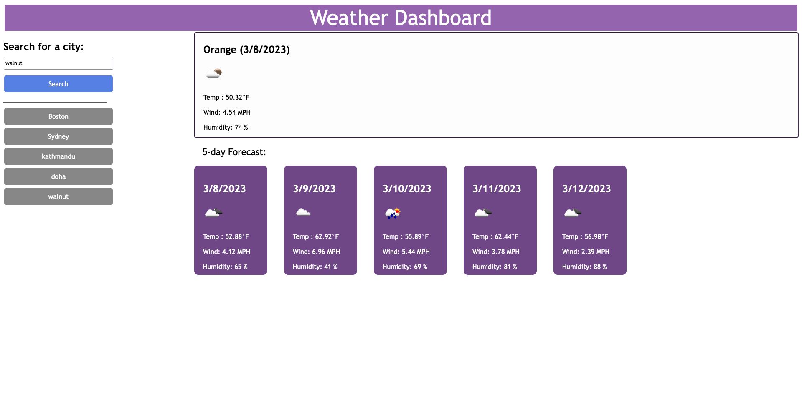

# weather-dashboard
## Description
A website to show the daily weather for cities and for other 5 days
## Technologies Used
-HTML
-Advanced CSS
-Java Script
-Web API
Fetch

## Table of contents
-Installation
-Usage
-Application
-License

## Installation
-Clone this repository(https://github.com/KritiShrestha/weather-dashboard) to your local machine 
-open the project in VS code or any other IDEs
-Run index.html in the live server. This will open the webpage in the browser

## Usage
A webpage calendar to show the daily weather for cities and for other 5 days

## Application
Here's the link to the deployed application - https://kritishrestha.github.io/weather-dashboard.

## License
MIT
